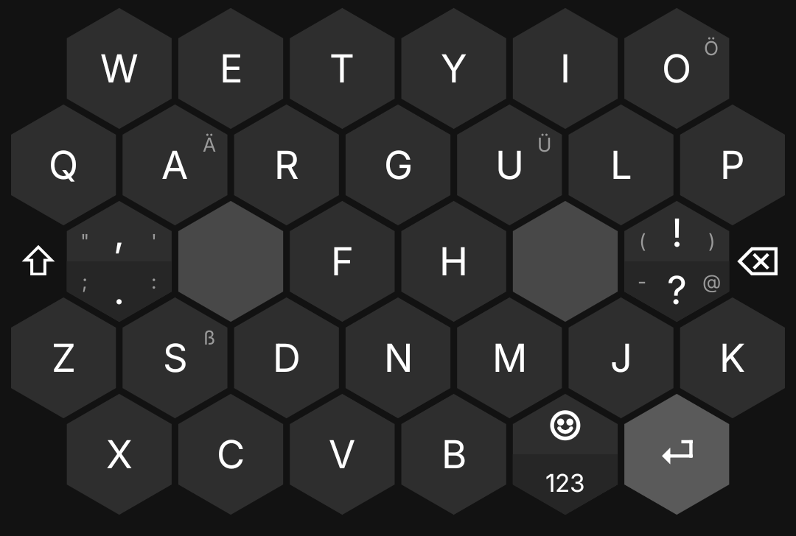
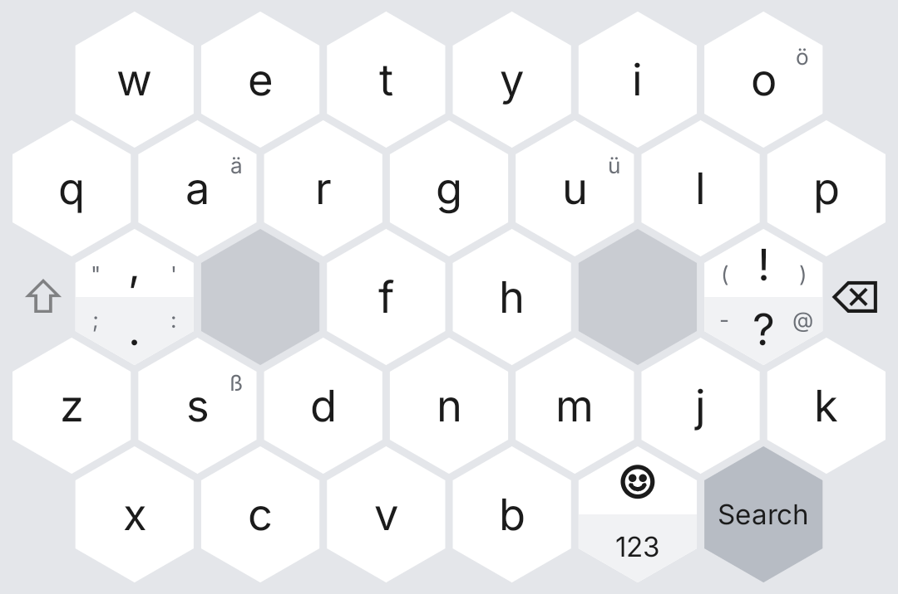

<p align="center"></p>

# Hexboard

A hexagonal keyboard for Android in the spirit of Typewise. Swipe a key
for capitals and extras, drag sideways to delete, select or move the
cursor, and make the layout your own.

<p align="center">
  
  
</p>

## Building

Needs Nix with flakes. The devShell provides the JDK, Gradle and the
Android SDK.

```sh
nix develop
gradle testDebugUnitTest assembleDebug
adb install -r app/build/outputs/apk/debug/app-debug.apk
```

Then enable "Hexboard" under the system's keyboard settings, or from the
Hexboard app, which also holds its settings.

## Releasing

Pushing a tag like `v1.2.3` makes CI build a signed, shrunk APK in the
same devShell and publish it as a GitHub release. The version comes from
the tag; its version code is `1·10000 + 2·100 + 3`.

The signing key lives outside the repository. Create it once, then store
it and its password as repository secrets as the script prints:

```sh
nix develop --command nu scripts/release-key.nu
```

Locally, `gradle assembleRelease` builds unsigned unless
`HEXBOARD_KEYSTORE` and `HEXBOARD_KEYSTORE_PASSWORD` point at the key.
A release cannot install over a debug build, which is signed with the
committed debug key; uninstall one before installing the other.

Progress and design notes live in [`docs/PLAN.md`](docs/PLAN.md).
